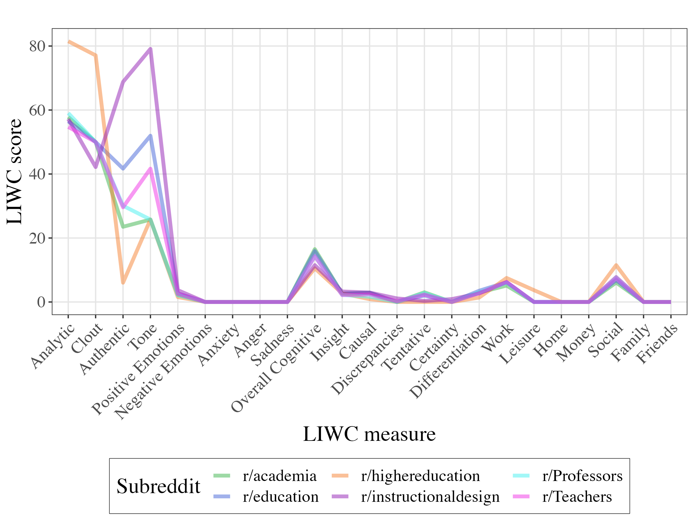

```{r setup, include=FALSE}
usethis::use_git_ignore(c("*.csv", "*.rds"))
options(htmltools.dir.version = FALSE)

library(knitr)
library(tidyverse)
library(xaringan)
library(fontawesome)
```

class: inverse, center, middle

# `r fa("fas fa-images", fill = "#fff")`

**View the slides:**

[bretsw.com/aect23-chatgpt](https://bretsw.com/aect23-chatgpt)

---

class: inverse, center, middle

# `r fa("fas fa-crow", fill = "#fff")` <br><br> Much Ado About ChatGPT

---

# `r fa("fas fa-crow", fill = "#fff")` Hello, ChatGPT

```{r, out.width = "600px", echo = FALSE, fig.align = "center"}

```

--

### Have you heard about **ChatGPT**?

--

<hr>

- Explosion in discourse in 2023 about ChatGPT, and more broadly **Generative AI** (GenAI)

--

- Educational game-changer `r fa("fas fa-arrows-left-right", fill = "#782F40")` "Stochastic parrot"?

---

# `r fa("fas fa-comments", fill = "#fff")` Reflection & Discussion

```{r, out.width = "100%", echo = FALSE, fig.align = "center"}
include_graphics("img/robot-parrot2.png")
```

### How have you experienced ChatGPT discourse this past year?

---

class: inverse, center, middle

# `r fa("fas fa-crow", fill = "#fff")` <br><br> Purpose: <br> Understand initial reaction <br> to ChatGPT

---

class: inverse, center, middle

# `r fa("fas fa-gauge-high", fill = "#fff")` <br><br> Method: <br> How to quickly measure <br> reaction to ChatGPT?

---

# `r fa("fas fa-table-list", fill = "#fff")` Data Collection

```{r, out.width = "600px", echo = FALSE, fig.align = "center"}

```

### How to quickly measure reaction?

--

<hr>

**naturalistic** (unobtrusive, not disrupting)

--

\+ **at scale** (reaction across education)

--

= **data mining**

---

# `r fa("fas fa-table-list", fill = "#fff")` Data Collection

```{r, out.width = "600px", echo = FALSE, fig.align = "center"}
include_graphics("img/robot-parrot-sand.png")
```

### digital traces

--

<hr>

in Reddit `r fa("fas fa-arrow-right", fill = "#782F40")` **subreddits** related to education

--

(e.g., r/education, r/Teachers, r/Professors, r/instructionaldesign)

--

n = **25 subreddits**

---

# `r fa("fas fa-table-list", fill = "#fff")` Data Collection

```{r, out.width = "600px", echo = FALSE, fig.align = "center"}
include_graphics("img/robot-parrot-sand.png")
```

### digital traces

<hr>

all posts containing keyword text "chatgpt" and related comments

--

first two months following ChatGPT's launch on November 30, 2022

--

**January 1, 2022 through January 31, 2023**

---

# `r fa("fas fa-gauge-high", fill = "#fff")` Data Analysis

```{r, out.width = "600px", echo = FALSE, fig.align = "center"}

```

### Measuring Reaction

--

<hr>

**LIWC:** Linguistic Inquiry & Word Count

--

**LIWC Dimensions:** summary, affect, social, cognitive processes, personal concerns

---

class: inverse, center, middle

# `r fa("fas fa-cubes-stacked", fill = "#fff")` <br><br> Results

---

# `r fa("fas fa-cubes-stacked", fill = "#fff")` Calendar

```{r, out.width = "600px", echo = FALSE, fig.align = "center"}

```

--

Earliest ChatGPT posts: 

--

- **12/6/22** in r/Teachers

--

- **12/10/22** in r/Professors and r/edtech

--

- **12/16/22** in r/instructionaldesign

---

# `r fa("fas fa-cubes-stacked", fill = "#fff")` Amount

```{r, out.width = "600px", echo = FALSE, fig.align = "center"}

```

--

**16,175 posts** in these 25 subreddits

--

**175 ChatGPT posts**, 3,417 comments on these posts

--

<hr>

**1.1%** of posts in education-related subreddits were about ChatGPT

---

# `r fa("fas fa-cubes-stacked", fill = "#fff")` Amount

```{r, out.width = "600px", echo = FALSE, fig.align = "center"}

```

- **4.2%** of r/Professors
- **3.5%** of r/edtech
- **2.5%** of r/highereduation
- **1.7%** of r/academia
- **0.7%** of r/Teachers
- **0.5%** of r/instructionaldesign
- **0.0%** in 10 subreddits (no ChatGPT posts in those first two months)

---

# `r fa("fas fa-cubes-stacked", fill = "#fff")` Engagement

```{r, out.width = "600px", echo = FALSE, fig.align = "center"}
include_graphics("img/robot-parrot2.png")
```

--

### Max comments per post:

--

<hr>

- **r/Professors: 237**
- r/Teachers: 145
- r/academia: 50
- r/education: 32
- r/instructionaldesign: 11
- r/highereducation: 3

---

# `r fa("fas fa-cubes-stacked", fill = "#fff")` Engagement

```{r, out.width = "600px", echo = FALSE, fig.align = "center"}
include_graphics("img/robot-parrot2.png")
```

### Max words per post:

<hr>

- **r/Teachers: 1,544**
- r/Professors: 1,182
- r/instructionaldesign: 305
- r/education: 247
- r/academia: 242
- r/highereducation: 76

---

# `r fa("fas fa-cubes-stacked", fill = "#fff")` Engagement

```{r, out.width = "600px", echo = FALSE, fig.align = "center"}
include_graphics("img/robot-parrot2.png")
```

### Max words per comment:

<hr>

- **r/Professors: 1,267**
- r/Teachers: 867
- r/education: 505
- r/academia: 342
- r/highereducation: 292
- r/instructionaldesign: 239

---

# `r fa("fas fa-cubes-stacked", fill = "#fff")` LIWC All Dimensions

```{r, out.width = "720px", echo = FALSE, fig.align = "center"}

```

---

# `r fa("fas fa-cubes-stacked", fill = "#fff")` LIWC Summary Dimensions

```{r, out.width = "720px", echo = FALSE, fig.align = "center"}

```

---

# `r fa("fas fa-cubes-stacked", fill = "#fff")` LIWC Summary Dimensions

```{r, out.width = "720px", echo = FALSE, fig.align = "center"}

```


---

# `r fa("fas fa-cubes-stacked", fill = "#fff")` Subreddit Content

```{r, out.width = "100%", echo = FALSE, fig.align = "center"}

```

---

class: inverse, center, middle

# `r fa("fas fa-comments", fill = "#fff")` <br><br> Reflection & Discussion

---

# `r fa("fas fa-comments", fill = "#fff")` Reflection & Discussion

```{r, out.width = "100%", echo = FALSE, fig.align = "center"}
include_graphics("img/robot-parrot2.png")
```

### How would you situate **Generative AI** tools in the long history of educational technologies?

---

class: inverse, center, middle

# `r fa("fas fa-question", fill = "#fff")` <br><br> Questions

**Bret Staudt Willet & Hunhui Na** | Florida State University

`r fa("envelope", fill = "#fff")` [bret.staudtwillet@fsu.edu](mailto:bret.staudtwillet@fsu.edu) | `r fa("globe", fill = "#fff")` [bretsw.com](https://bretsw.com) | `r fa("fab fa-github", fill = "#fff")` [GitHub](https://github.com/bretsw/)

<br><br>
<hr>

<div class="caption">
Images created with Midjourney. Slides made with RMarkdown.
</div>